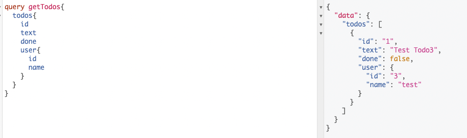
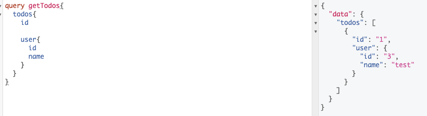
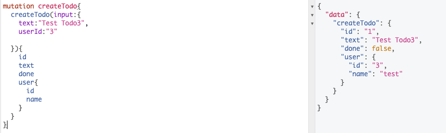

# GraphQL 

```
go run github.com/99designs/gqlgen init

```

## Applied after schema change.
```
go run github.com/99designs/gqlgen generate
```

## Dockerize Command
```
docker compose down && docker compose up --build

default uri : http://localhost:8080/
```

## Query Example


<p>
    

</p>

### Different Query

<p>


</p>

## Create Todo

<p>


</p>